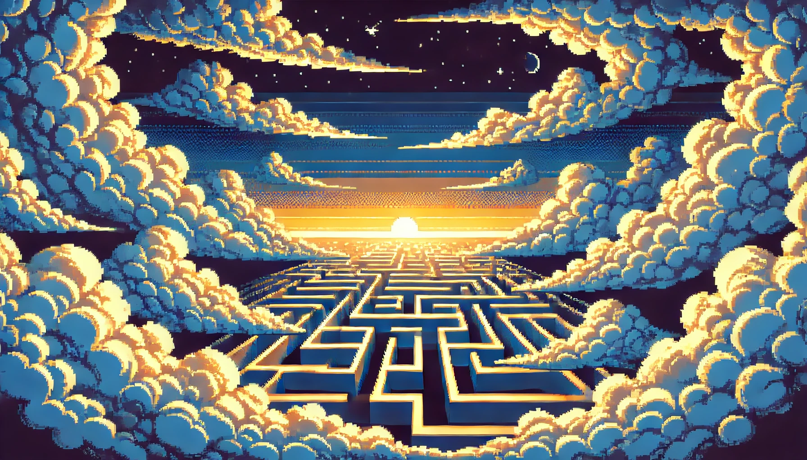

# **SKY MAZE**




_Sky Maze_ es un juego multijugador que acepta hasta cuatro jugadores, cada uno elije entre seis fichas disponibles -cada una con una habilidad diferente- y se mueve a través de las casillas de un tablero de dimensión n x n con el objetivo de, esquivando trampas, llegar al centro del tablero, y escapar del cielo.


## **INSTALACIÓN**


1. Requisitos para su instalación
   - Verificar tener [DOTNET SDK](https://dotnet.microsoft.com/en-us/download) previamente instalado.


2. Clonar el repositorio:

   - ```git clone https://github.com/p4tt7/sky-maze.git```


3. Build repositiorio:

   - ```dotnet build```


4. Correr el juego:

   - ```dotnet run```


## **INSTRUCCIONES**

### _MENU PRINCIPAL_  
En primera instancia los jugadores se encontrarán con el Menú Princpal como punto de inicio, donde tendrán las opciones:  


 - _PLAY:_ Inicia el juego, y pasa al Menú de Selección  

 - _EXIT:_ Cierra el juego por completo.  


### _MENÚ DE SELECCIÓN_  
Al seleccionar _PLAY_ ingresando su índice correspondiente _1_, se brindan instrucciones básicas para el uso del juego, los cuales pueden ser omitidos presionando _ENTER_ y así pasar al siguiente menú, el Menú de Selección, aquí los jugadores podrán seleccionar:  

 - Cantidad de jugadores: Se pueden ingresar hasta 4, e inmediatamente se introduce el nombre de cada uno.  

 - Ficha: Cada jugador elige la ficha que usará en la partida, cada una tiene una habilidad asociada que puede ser activada en dependencia del cooldown y una velocidad determinada:  


  
### Arcoiris 🌈
| Propiedad     | Valor         |
|---------------|---------------|
| Velocidad     | 4             |
| CoolingTime   | 2             |
| Habilidad     |  Iris Healing       |
  
### Luna Nueva 🌑
| Propiedad     | Valor         |
|---------------|---------------|
| Velocidad     | 3             |
| CoolingTime   | 4             |
| Habilidad     | Slowing Shadow       |
  
### Viento 🍃
| Propiedad     | Valor         |
|---------------|---------------|
| Velocidad     | 2             |
| CoolingTime   | 3             |
| Habilidad     | Zephyr Dash  |
  
### Nube ⛅
| Propiedad     | Valor         |
|---------------|---------------|
| Velocidad     | 3             |
| CoolingTime   | 5             |
| Habilidad     | Piercing Cloud           |
  
### Estrella ✨
| Propiedad     | Valor         |
|---------------|---------------|
| Velocidad     | 3             |
| CoolingTime   | 4             |
| Habilidad     | Star Daze         |
  
### Eclipse 🌘
| Propiedad     | Valor         |
|---------------|---------------|
| Velocidad     | 4             |
| CoolingTime   | 5             |
| Habilidad     | Mimic Eclipse       |

  

    
**Iris Healing:** Es capaz de curarse del estado impuesto por una trampa.

    

**Slowing Shadow:** Genera casillas aleatorias sobre el laberinto capaz de reducir la velocidad de los jugadores y evitar que lleguen antes a la meta.

    

**Zephyr Dash:** Aumenta la velocidad de la ficha en 10, siendo capaz de moverse hasta 12 casillas por turno.


**Piercing Cloud:** La nube puede crear un camino de obstáculos a su paso, logrando bloquear caminos.


**Star Daze:** La estrella rompe todo en su camino (excepto fichas).


**Mimic Eclipse:** Puede copiar cualquier habilidad de las fichas que se encuentren en el tablero.


_NOTA: Cada jugador puede elegir una única ficha y no puede ser repetida por los demás, una vez un jugador elija una ficha, será inmediatamente retirada de la lista de fichas disponibles._


 - Nivel de dificultad: Afecta directamente la dimensión del tablero y probabilidad de generación de trampas:


| DIFICULTAD | DIMENSIÓN | PROBABILIDAD DE TRAMPA |
|------------|-----------|------------------------|
| FACIL      | 13        | 7%                     |
| INTERMEDIO | 15        | 8%                     |
| DIFÍCIL    | 19        | 9%                     |


Así, la cantidad de trampas se reparte proporcional a la cantidad de casillas que posee el tablero.


### _FLUJO DEL JUEGO_ 


#### Partes del laberinto


 1. Fichas: Las fichas se inicializan en las respectivas esquinas del laberinto, se garantiza que no serán bloqueadas durante la generación de este.


   
 2. Centro del tablero: Es la condición de victoria, un "🟦" que representa la puerta de salida del cielo.


   
 3. Obstáculos: Delimitan el laberinto, representados por un "⬜". Un movimiento regular no permitirá a la ficha avanzar si una casilla es obstáculo, a menos que la habilidad inherente a esta sea capaz de evitarlos.

_NOTA: Si en el movimiento, los jugadores intentan caminar hacia un obstáculo, no se contará como un  movimiento invalido y por tanto, no se reduce la velocidad_


 4. Trampas: Se generan aleatoriamente por el tablero, se clasifican en dos tipos: _Instantáneas y Continuas_, donde la principal diferencia es la duración de su efecto sobre el jugador.

### Copo de Nieve
| Propiedad | Valor        |
|-----------|--------------|
| Nombre    | Copo de Nieve|
| Símbolo   | ⛄            |
| Habilidad | Congelar     |
| Efecto    | No puede moverse por 3 turnos|

### Lluvia
| Propiedad | Valor        |
|-----------|--------------|
| Nombre    | Lluvia       |
| Símbolo   | ☔            |
| Habilidad | Mojar        |
| Efecto    | Estado "Mojado" por 5 turnos, potencial de resbalar a casilla aleatoria cercana |

### Rayo
| Propiedad | Valor        |
|-----------|--------------|
| Nombre    | Rayo         |
| Símbolo   | ⚡            |
| Habilidad | Electrificar |
| Efecto    | Devuelve al jugador al inicio del juego |

### Skyhole
| Propiedad | Valor        |
|-----------|--------------|
| Nombre    | Skyhole      |
| Símbolo   | 🌀            |
| Habilidad | Teletransportar |
| Efecto    | Mueve al jugador a una posición aleatoria en el rango del laberinto |

Las trampas _Skyhole_ y _Rayo_ son inmediatas, mientras que _Copo de nieve_ y _LLuvia_ imponen sobre la ficha un estado de "congelado" o "mojado" que dura por 3 y 5 turnos respectivamente.

### Informaciones dadas bajo el laberinto

 1. Nombre del jugador al que corresponde el turno.
    
 2. Teclas escenciales para comenzar a moverse (_ENTER_) o seleccionar la habilidad (_X_)
    
_NOTA: La habilidad de cada ficha solo puede ser seleccionada al inicio del turno del jugador, una vez comience a moverse, deberá esperar a su próximo turno_

 3. Por cada paso, se mostrará al jugador:
    
 - Cantidad de pasos restantes que puede avanzar.
   
 - Cooldown de su habilidad.
   
 - Estado de la ficha.


| Ejemplo           |
|-----------------------|
| Movimientos restantes: 5 |
| Cooldown de habilidad: 0 |
| Estado: Congelado       |


## CONTROLES
En _Sky Maze_, tienes varias opciones para mover tu ficha y utilizar habilidades:


**Flechas del Teclado:**
 - Flecha Arriba: Mueve tu ficha hacia arriba.
 - Flecha Abajo: Mueve tu ficha hacia abajo.
 - Flecha Izquierda: Mueve tu ficha hacia la izquierda.
 - Flecha Derecha: Mueve tu ficha hacia la derecha.


**Teclas WASD:**
 - W: Equivalente a la flecha arriba.
 - A: Equivalente a la flecha izquierda.
 - S: Equivalente a la flecha abajo.
 - D: Equivalente a la flecha derecha.


**X:**
Activa la habilidad especial asociada a tu ficha.


**Enter:**
Presiona Enter para que tu ficha se mueva, luego de activar una habilidad, debes presionarlo para resumir tu movimiento.


# ARQUITECTURA DEL JUEGO

## LOGICA

## sky-maze-logic.cs
Contiene la logica del Menú de Selección, crucial para el resto de configuración del laberinto.

## Board.cs
Maneja la generación, configuración, y validación del laberinto.

Con el valor de dimensión que toma del Menú de Selección por el nivel de dificultad, se crea un array bidimensional tipo string, que se inicializa en primera instancia como paredes (_BoardInitializer()_). Esta clase se encarga de generar el laberinto con el algoritmo de Recursive Backtrack(_BoardGenerator()_). Una vez generado, para garantizar que la inicialización de las fichas y el no sellado del centro, se crea un array bidimencional tipo int que detecta qué casillas han sido inalcanzables (_DistanceValidator_). Por último, un método corrije los errores de generación en base a dicho array de enteros (_ValidatedBoard_), y está listo.


## Ficha.cs
Define las fichas prestablecidas, así cómo sus propiedades Nombre, Símbolo. Posición, Velocidad, CoolingTime, State, StateDuration, CurrentCoolingTime, CurrentVelocidad.

Esta clase es quien se encarga de inicializar las fichas en el tablero, además que define los mátodos de cada habilidad, asi como su modo de activacián.


## Player.cs
Asigna a cada jugador un nombre, la ficha seleccionada, la posición inicial de su ficha; además crea la lista de los jugadores en la partida, y su index respectivo para manejarlos. 


## Position.cs
Con las variables enteras x, y, es que se permite el movimiento y la localización de los objetos en el tablero. Con el método _Movement()_ es que cada jugador es capaz de manejar el movimiento de la ficha, además, detecta cuando una casilla es pared, es otra ficha, o si se cumple la condición de victoria.


## Trampa.cs
Parecido a la clase Ficha.cs, se definen las trampas prestablecidas y se generan aleatoriamente en el laberinto (solo donde hay camino). La clase contiene los métodos DetectarTrampa() y ActivateTrampa() para controlar el funcionamiento de estas, y por último se encuentran los métodos con las habilidades de cada una.


## sky-maze-ui.cs
Se encarga de la interfaz visual básica, utiliza principalmente la .NET library Sprectre Console para añadir colores y elementos visualmente atractivos.


## Program.cs
Controla el flujo principal del juego, los turnos, cooldown, movimiento, activación de habilidades son todas manejadas aquí, desde el punto inicial llamando al inicio, hasta la revisión de la condición de victoria que culmina el juego. La clase Program coordina todos los aspectos del juego, desde la configuración inicial hasta la lógica de turnos y la interacción con el usuario, asegurando un flujo de juego coherente y manejable. Utiliza métodos de otras clases (GameUI, GameLogic, Board, Trampa, Ficha, Position, Player) para ejecutar las diferentes fases y funcionalidades del juego.

 
